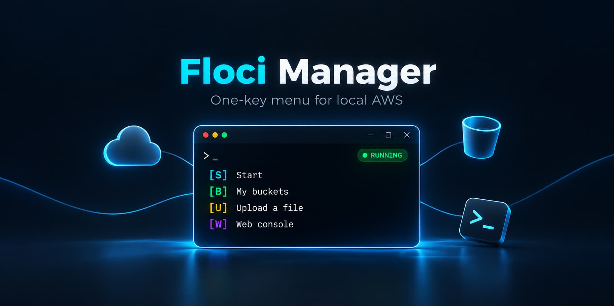
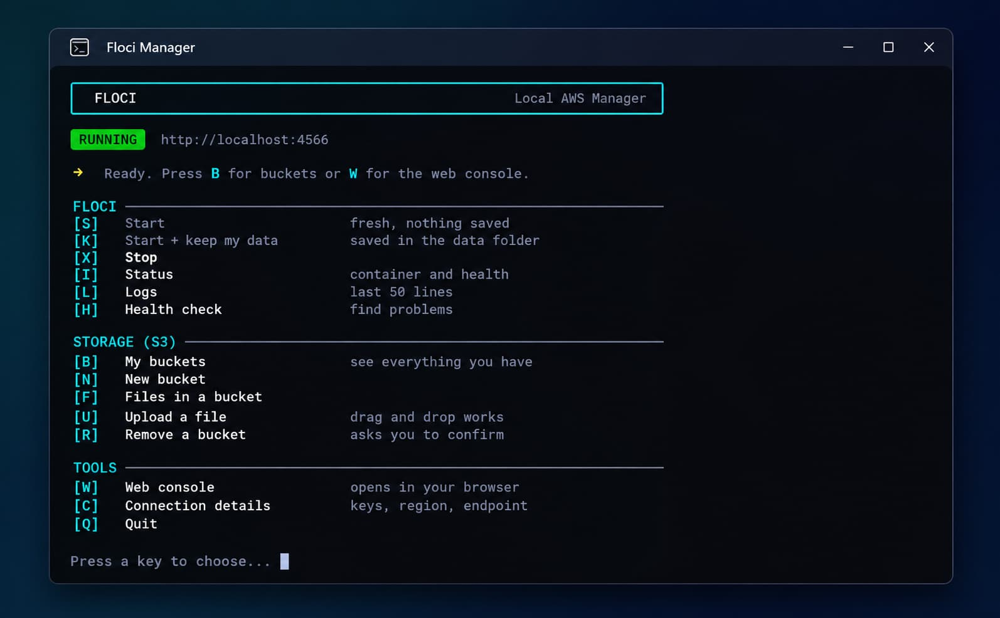

<div align="center">



# Floci Manager

A one-key menu for [Floci](https://github.com/floci-io/floci) on Windows.

[](LICENSE)
[](https://github.com/abubakar-shaikh-dev/floci-manager/releases/latest)


</div>

---

Floci Manager is a single batch file. It wraps the Floci CLI and the AWS CLI in a menu, so you can start Floci, manage S3 buckets and upload files without typing commands.



## Contents

- [Requirements](#requirements)
- [Install](#install)
- [Usage](#usage)
- [Keys](#keys)
- [Connecting your code](#connecting-your-code)
- [Configuration](#configuration)
- [Troubleshooting](#troubleshooting)
- [Contributing](#contributing)
- [License](#license)

## Requirements

- Windows 10 or 11
- [Docker Desktop](https://www.docker.com/products/docker-desktop/)
- [Floci CLI](https://floci.io)
- [AWS CLI](https://aws.amazon.com/cli/) (only needed for the S3 menu)

Install the Floci CLI from PowerShell:

```powershell
iwr https://floci.io/install.ps1 | iex
```

## Install

Download `floci-manager.bat` from the [latest release](https://github.com/abubakar-shaikh-dev/floci-manager/releases/latest), or clone the repo:

```bash
git clone https://github.com/abubakar-shaikh-dev/floci-manager.git
```

No other setup is needed.

## Usage

1. Start Docker Desktop and wait until it is running.
2. Double-click `floci-manager.bat`.
3. Press `S` to start Floci.

Floci is then available at `http://localhost:4566`.

The menu shows only the keys that work right now. For example, the bucket keys are greyed out while Floci is stopped.

## Keys

### Floci

| Key | Action |
|:---:|---|
| `S` | Start. Nothing is saved. |
| `K` | Start and keep data in the `data` folder. |
| `X` | Stop. |
| `I` | Show status. |
| `L` | Show the last 50 log lines. |
| `H` | Run a health check. |

### Storage (S3)

| Key | Action |
|:---:|---|
| `B` | List buckets. |
| `N` | Create a bucket. |
| `F` | List files in a bucket. |
| `U` | Upload a file. Drag and drop works. |
| `R` | Remove a bucket. You must type its name to confirm. |

### Tools

| Key | Action |
|:---:|---|
| `W` | Open the web console in your browser. |
| `C` | Show connection details. |
| `Q` | Quit. Floci keeps running. |

## Connecting your code

Press `C` in the menu to see these values at any time.

| Setting | Value |
|---|---|
| Endpoint | `http://localhost:4566` |
| Access key | `test` |
| Secret key | `test` |
| Region | `us-east-1` |

Enable path-style S3 addressing in your SDK. Virtual-hosted style does not work with `localhost`.

## Configuration

**Port.** The default is `4566`. To change it, set `FLOCI_PORT` before you run the script:

```bat
set FLOCI_PORT=4599
floci-manager.bat
```

**Saved data.** Data from `K` is stored in a `data` folder next to the script. Delete the folder to start clean.

## Troubleshooting

**Floci CLI not found.** Install it with the command in [Requirements](#requirements), then run the script again.

**Docker is not running.** Start Docker Desktop and wait until it reports that it is running.

**Floci does not start.** Press `H` to run the health check.

**Port already in use.** Press `X`. It stops Floci and frees the port. You can also set a different port with `FLOCI_PORT`.

**Broken box characters.** Run the script in Windows Terminal, or update Windows. Older consoles cannot show these characters.

**AWS CLI not found.** Only the S3 menu needs it. Install it from [aws.amazon.com/cli](https://aws.amazon.com/cli/).

## Contributing

Issues and pull requests are welcome.

- Save `.bat` files as UTF-8 without BOM.
- Keep CRLF line endings. `.gitattributes` handles this.
- Test on Windows 10 and 11 if you can.

## License

[MIT](LICENSE)

This is an unofficial tool. It is not affiliated with the Floci project.
