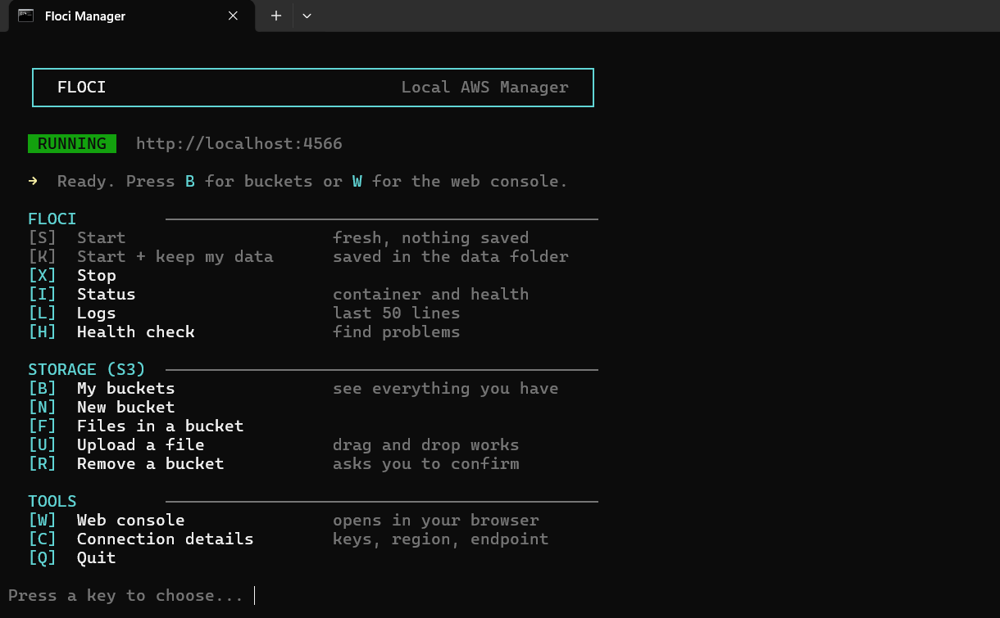

<div align="center">


<br>

### One-key menu for [Floci](https://github.com/floci-io/floci) on Windows
Start local AWS, manage S3 buckets and upload files. No commands to remember.

<br>

[](LICENSE)
[](#requirements)
[](https://github.com/abubakar-shaikh-dev/floci-manager/releases/latest)
[](https://github.com/abubakar-shaikh-dev/floci-manager/stargazers)

[**Quick start**](#-quick-start) · [**Keys**](#-keys) · [**Connect your code**](#-connect-your-code) · [**Help**](#-help)

</div>

<br>



<br>

## ✨ Why Floci Manager?

Floci gives you a free AWS on your computer. But typing the same long commands again and again is slow. Floci Manager turns them into **one key press**.

| Without Floci Manager | With Floci Manager |
|---|---|
| `floci start --persist .\data` | Press <kbd>K</kbd> |
| `aws s3 mb s3://my-bucket --endpoint-url http://localhost:4566` | Press <kbd>N</kbd> |
| `aws s3 cp file.zip s3://my-bucket/ --endpoint-url ...` | Press <kbd>U</kbd>, drag your file in |
| `aws s3 rb s3://my-bucket --force --endpoint-url ...` | Press <kbd>R</kbd> |

<br>

## 🚀 Quick start

**1.** Install the [requirements](#requirements) below.

**2.** Download `floci-manager.bat` from the [latest release](https://github.com/abubakar-shaikh-dev/floci-manager/releases/latest), or clone:

```bash
git clone https://github.com/abubakar-shaikh-dev/floci-manager.git
```

**3.** Open Docker Desktop. Wait until it says **running**.

**4.** Double-click `floci-manager.bat` and press <kbd>S</kbd>.

Done. Floci is now running at `http://localhost:4566`.

<br>

## 🧰 Features

| | |
|---|---|
| ▶️ **Start and stop** | Run Floci fresh, or keep your data between restarts |
| 🪣 **S3 buckets** | Create, list and delete buckets |
| 📤 **File upload** | Drag and drop a file into the window |
| 🌐 **Web console** | Opens in your browser with one key |
| 🩺 **Health check** | Finds problems and tells you what to do |
| 🛡️ **Safe delete** | You must type the bucket name before anything is removed |
| 🎯 **Smart menu** | Keys that cannot work right now turn grey |
| 🔧 **Custom port** | Change the port with one setting |

<br>

## 📋 Requirements

| What | Why | Get it |
|---|---|---|
| **Windows 10 or 11** | Colors and `curl` | |
| **Docker Desktop** | Floci runs inside Docker | [Download](https://www.docker.com/products/docker-desktop/) |
| **Floci CLI** | Starts Floci | See below |
| **AWS CLI** | Only for the bucket menu | [Download](https://aws.amazon.com/cli/) |

Install the Floci CLI. Open PowerShell and run:

```powershell
iwr https://floci.io/install.ps1 | iex
```

<br>

## ⌨️ Keys

**Floci**

| Key | Action | |
|:---:|---|---|
| <kbd>S</kbd> | Start | Fresh, nothing saved |
| <kbd>K</kbd> | Start + keep my data | Saved in the `data` folder |
| <kbd>X</kbd> | Stop | |
| <kbd>I</kbd> | Status | Container and health |
| <kbd>L</kbd> | Logs | Last 50 lines |
| <kbd>H</kbd> | Health check | Find problems |

**Storage (S3)**

| Key | Action | |
|:---:|---|---|
| <kbd>B</kbd> | My buckets | See everything you have |
| <kbd>N</kbd> | New bucket | |
| <kbd>F</kbd> | Files in a bucket | |
| <kbd>U</kbd> | Upload a file | Drag and drop works |
| <kbd>R</kbd> | Remove a bucket | Asks you to confirm |

**Tools**

| Key | Action | |
|:---:|---|---|
| <kbd>W</kbd> | Web console | Opens in your browser |
| <kbd>C</kbd> | Connection details | Keys, region, endpoint |
| <kbd>Q</kbd> | Quit | Floci keeps running |

<br>

## 🔌 Connect your code

Press <kbd>C</kbd> in the menu to see this anytime.

| Setting | Value |
|---|---|
| Endpoint | `http://localhost:4566` |
| Access key | `test` |
| Secret key | `test` |
| Region | `us-east-1` |

> [!TIP]
> In your code, turn on **path-style S3 addressing**. Without it, bucket URLs will not work on localhost.

<br>

## ⚙️ Settings

**Use another port** (default is `4566`):

```bat
set FLOCI_PORT=4599
floci-manager.bat
```

**Saved data** lives in the `data` folder next to the `.bat` file. Delete the folder to start clean.

<br>

## 🆘 Help

<details>
<summary><b>"Floci CLI not found"</b></summary>
<br>
Install it with the PowerShell command in <a href="#requirements">Requirements</a>, then open the file again.
</details>

<details>
<summary><b>"Docker is not running"</b></summary>
<br>
Open Docker Desktop and wait until it says <b>running</b>. Then try again.
</details>

<details>
<summary><b>Floci will not start</b></summary>
<br>
Press <kbd>H</kbd> for the health check. It shows what is wrong.
</details>

<details>
<summary><b>Port is already in use</b></summary>
<br>
Press <kbd>X</kbd>. It stops Floci and also frees the port. Or use another port with <code>FLOCI_PORT</code>.
</details>

<details>
<summary><b>Strange symbols instead of boxes</b></summary>
<br>
Use <b>Windows Terminal</b>, or update Windows. Old consoles cannot show these symbols.
</details>

<details>
<summary><b>"AWS CLI not found"</b></summary>
<br>
Only the bucket menu needs the AWS CLI. Install it from <a href="https://aws.amazon.com/cli/">aws.amazon.com/cli</a>.
</details>

<br>

## 🤝 Contributing

Pull requests are welcome. Please:

- Save `.bat` files as **UTF-8 without BOM**
- Keep **CRLF** line endings (`.gitattributes` does this for you)
- Keep text short and simple

Found a bug or have an idea? [Open an issue](https://github.com/abubakar-shaikh-dev/floci-manager/issues).

<br>

## 📄 License

[MIT](LICENSE) © [abubakar-shaikh-dev](https://github.com/abubakar-shaikh-dev)

<br>

<div align="center">

**If this saved you time, give it a ⭐**

<sub>Unofficial tool. Not made by or connected to the Floci team.</sub>

</div>
